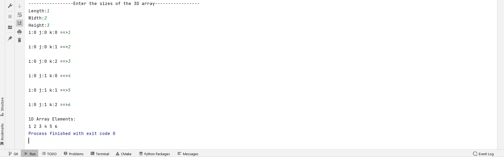
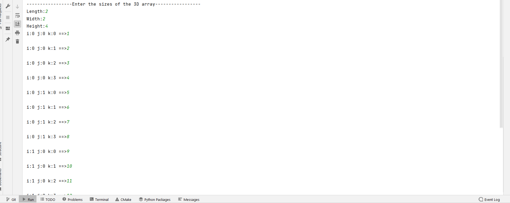
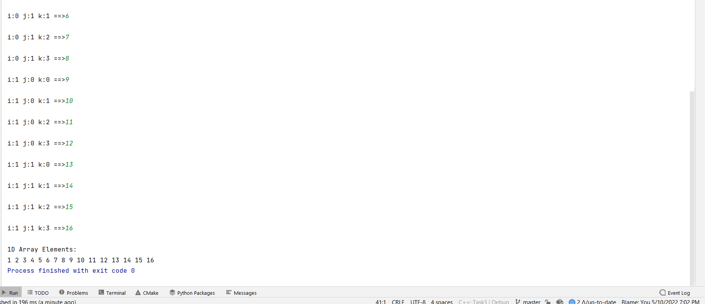
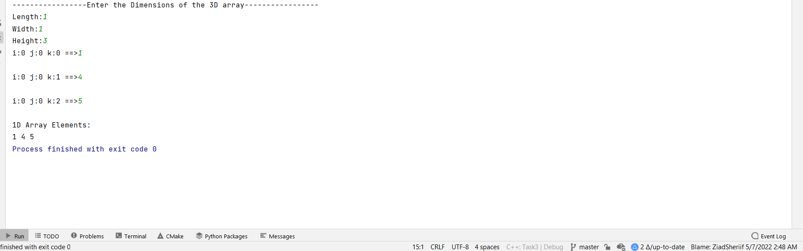

[//]: # (<div align="center">)

[//]: # ()

[//]: # ([![contributors]&#40;https://img.shields.io/github/contributors/ZiadSheriif/Matrix-Flatten&#41;]&#40;https://github.com/ZiadSheriif/Matrix-Flatten/contributors&#41;)

[//]: # ([![license]&#40;https://img.shields.io/pypi/l/ansicolortags.svg&#41;]&#40;LICENSE&#41;)

[//]: # ([![forks]&#40;https://img.shields.io/github/forks/ZiadSheriif/Matrix-Flatten&#41;]&#40;https://github.com/ZiadSheriif/Matrix-Flatten/network&#41;)

# Matrix-Flatten

[//]: # ([![issues]&#40;https://img.shields.io/github/issues/ZiadSheriif/Matrix-Flatten&#41;]&#40;https://github.com/ZiadSheriif/Matrix-Flatten/issues&#41;)

[//]: # ()

[//]: # (</div>)

<!-- <div align="center">

[//]: # ([![stars]&#40;https://img.shields.io/github/stars/ZiadSheriif/Matrix-Flatten&#41;]&#40;https://github.com/ZiadSheriif/Matrix-Flatten/stargazers&#41;)

</div> -->

A 3D matrix is to be stored in a 1D vector (flattened).

## Description

* Convert the 3D matrix index (i, j, k) to a suitable 1D vector index (y). Must be O(1).

## Getting Started

### Dependencies

* C++

### Installing

```
git clone https://github.com/ZiadSheriif/Matrix-Flatten 
```

```
gcc main.cpp
```

```
./a.out
```

### Screenshots






## Contributors

<table>
 <td align="center">
    <a href="https://github.com/ZiadSheriif" target="_black">
    
    <br />
    <sub><b>Ziad Sherif</b></sub></a>
    </td>
<tr></tr>
</table>

## License <a name="license"></a>

> This software is licensed under MIT License, See [License](https://github.com/ZiadSheriif/Matrix-Flatten/blob/master/LICENSE) for more information ©ZiadSheriif.

