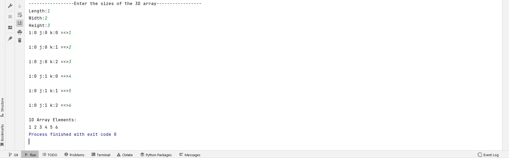
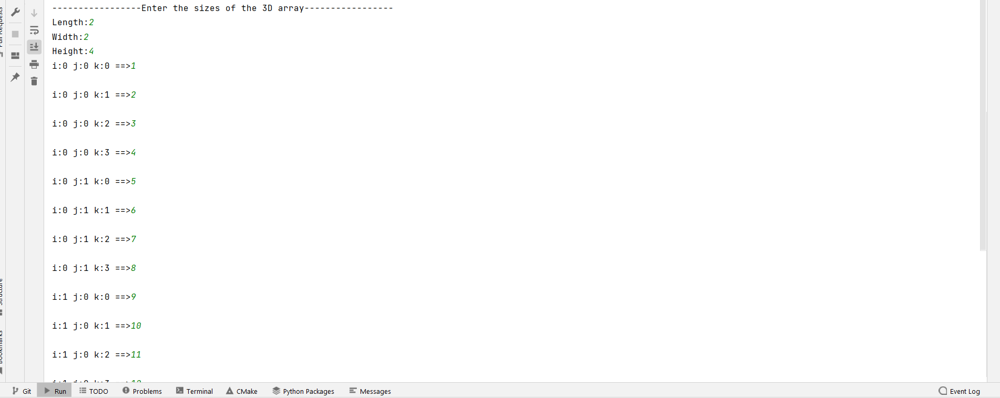
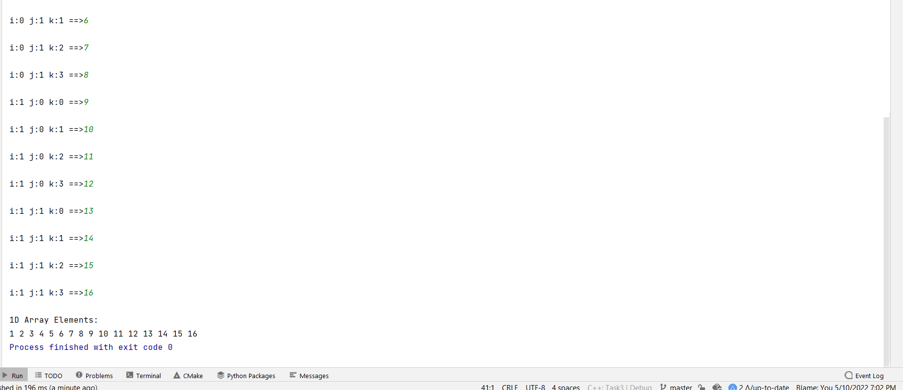
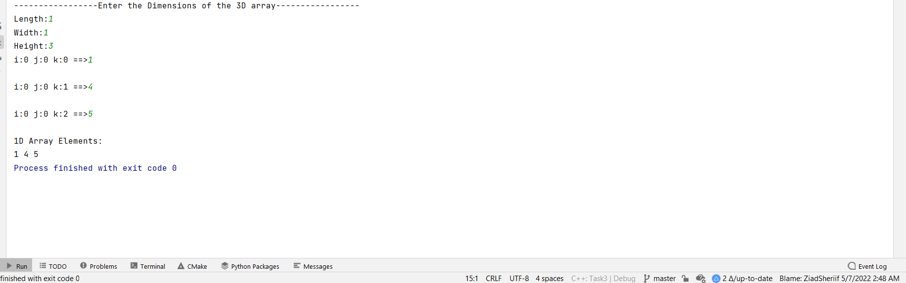

<div align="center">

# Matrix-Flatten

</div>

<div align="center">

[](https://github.com/Abd-ELrahmanHamza/Matrix_Flatten/contributors)
[](LICENSE)
[](https://github.com/Abd-ELrahmanHamza/Matrix_Flatten/network)
[](https://github.com/Abd-ELrahmanHamza/Matrix_Flatten/stargazers)
[](https://github.com/Abd-ELrahmanHamza/Matrix_Flatten/issues)

</div>

A 3D matrix is to be stored in a 1D vector (flattened).
## Description
* Convert the 3D matrix index (i, j, k) to a suitable 1D vector index (y). Must be O(1).

## Getting Started

### Dependencies

* C++

### Installing

```
git clone https://github.com/ZiadSheriif/Matrix-Flatten 
```

```
gcc main.cpp
```

```
./a.out
```

### Screenshots






[//]: # ( &#40;## Contributors&#41;)

